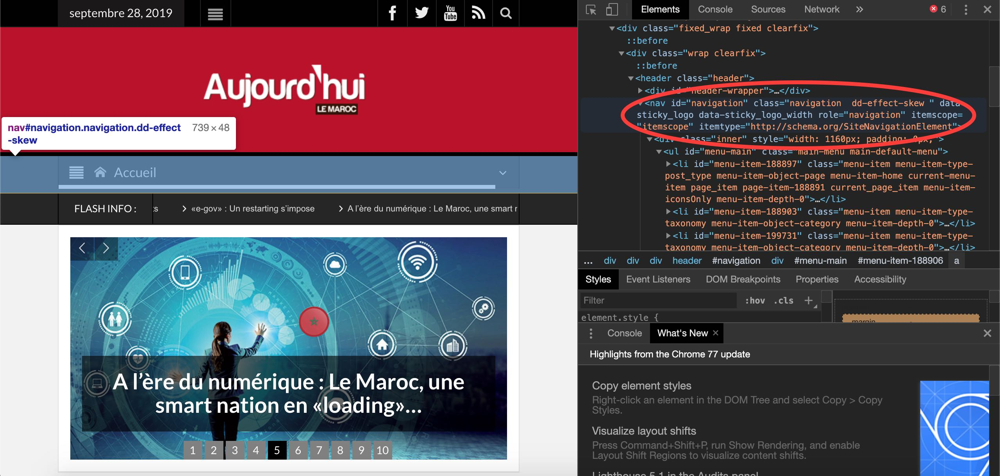
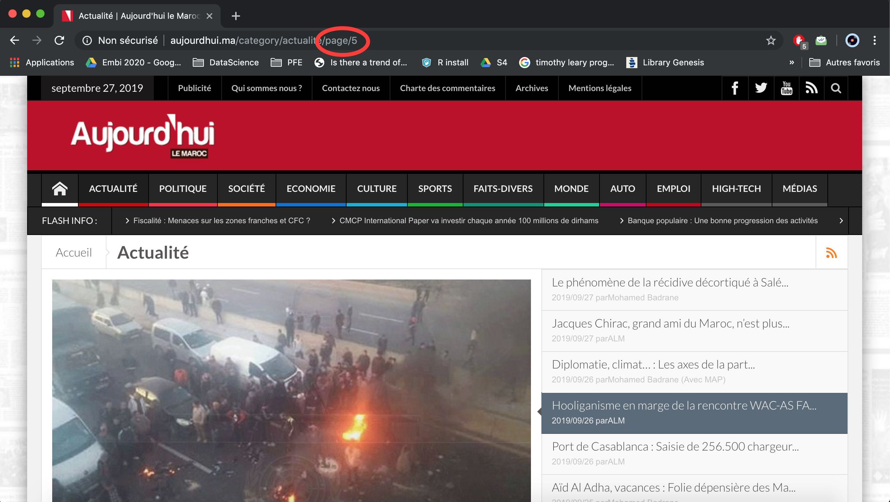
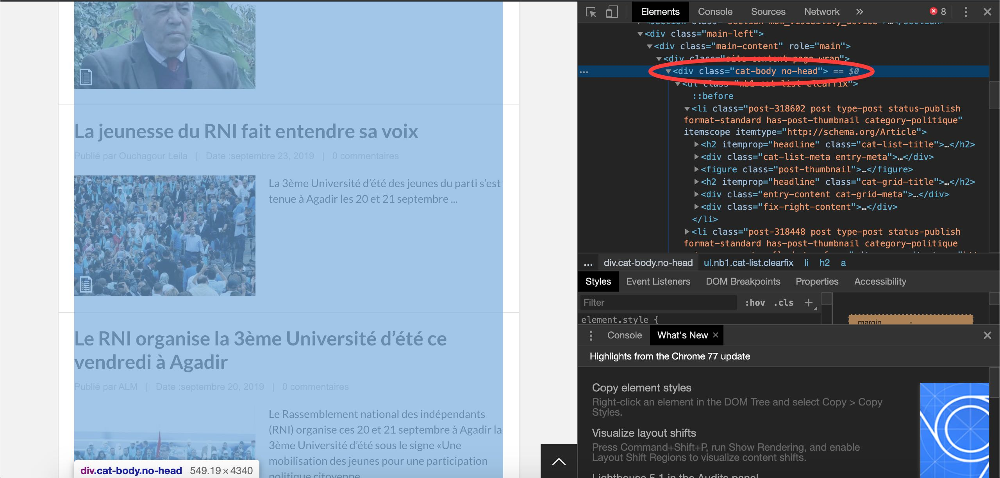
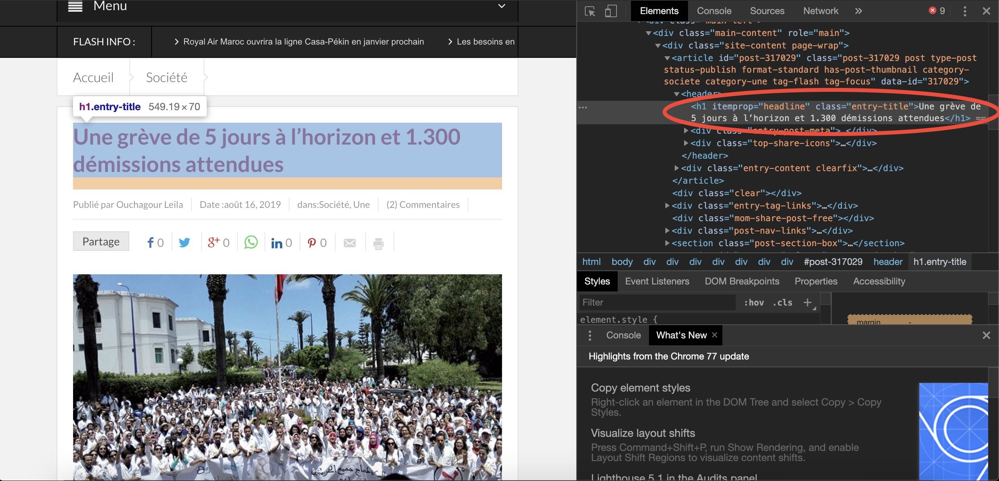
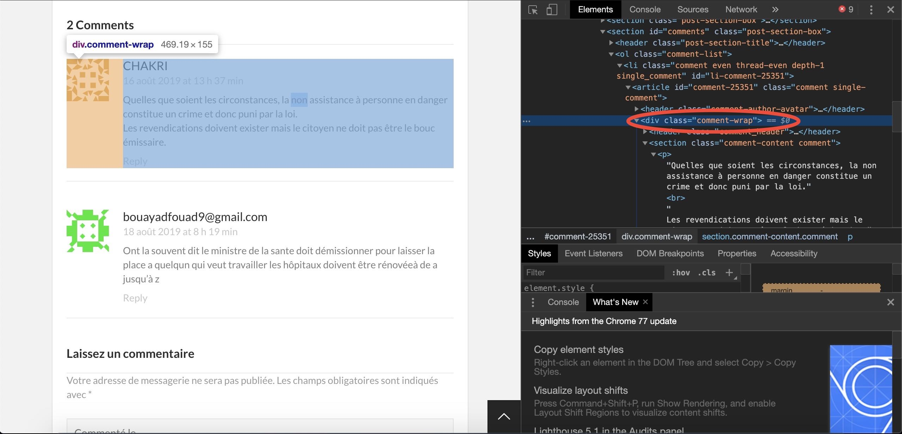
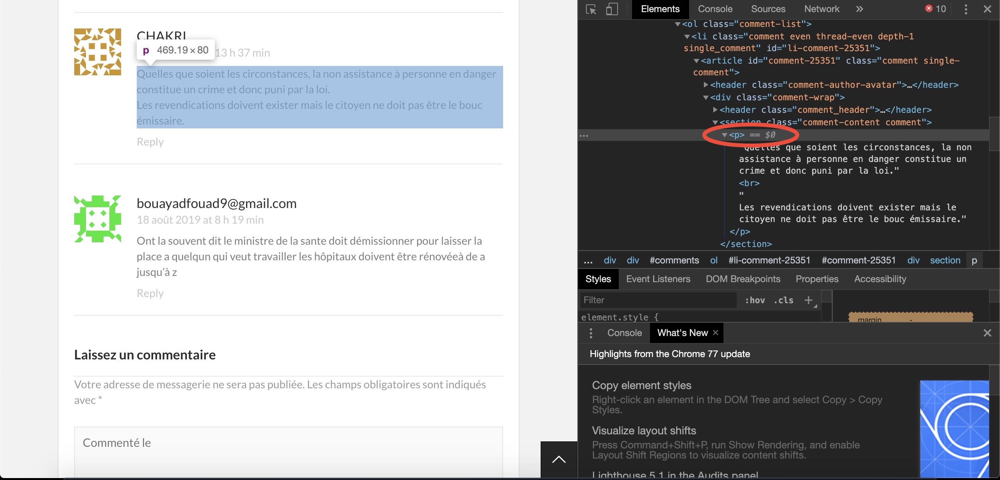
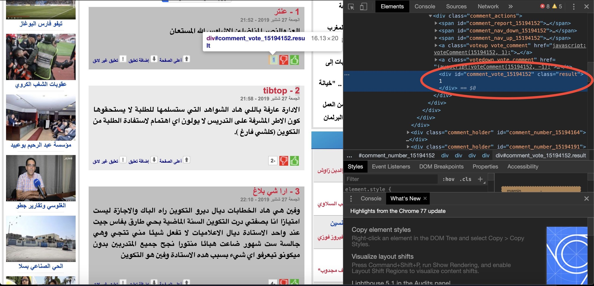
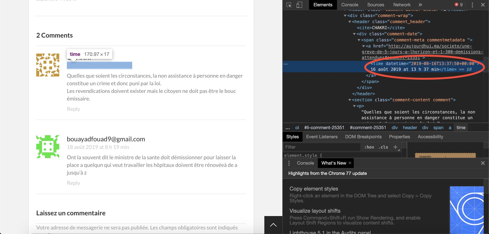

# Web Scraper
A Web scraper that can help extarct comments from informational websites then load them in a csv file.

## Description

Web scraping is a technique currently used by Data Scientist, Data Analysts and Business Intelligence engineers to get data from websites then clean it, prepare it and then work with it in their projects.

This technique consists on parsing the html code of a website into a programming language such as Python and then manipulated to get data/text from it.

This tool is a solution to scrape comments content and details from informational websites by adding a configuration of the trageted website in the **config.json** file. 

## Requirements

* The version of python used to develop this tool is 3.6.5.
* Use the package manager [pip](https://pip.pypa.io/en/stable/) to install all the requirements.
* To read the configuration of the targeted website from **config.json** file, we will need [simplejson](https://simplejson.readthedocs.io/en/latest/) library (v 3.16.0 or newer).
```bash
pip install simplejson
```
* Then install [requests](https://pypi.org/project/requests/) library (v 2.22.0 or newer) by using [pip](https://pip.pypa.io/en/stable/).
```bash
pip install requests
```
* Then install [Beautiful Soup](https://www.crummy.com/software/BeautifulSoup/bs4/doc/) library (v 4.8.0 or newer) so that we can pull data out of HTML files.
```bash
pip install beautifulsoup4
```
* To structure the data scraped from the targeted website and load it in a csv file, we will need to install [pandas](https://pandas.pydata.org/pandas-docs/stable/) library (v 0.23.0 or newer).
```bash
pip install pandas
```

## Getting Started

1. Clone this repository.
2. Open the [**config.json**](config.json) file and fill it with the configuration of the targeted website :

* ***home_url :*** copy and paste url of the home page of the website.



* ***nav_ul_id :*** inspect the navigation bar of the website and copy and paste the **id** of **ul** tag if there is one, if it doesn't exist then let it empty (like in the screenshot above).
* ***nav_ul_class :*** inspect the navigation bar of the website and copy and paste the **class** of **ul** tag if ther is one, if it doesn't exist then let it empty (like in the screenshot above).



* ***Pagination :*** select one of the fields of the **navigation bar**, and in the **pagination bar** located at the bottom of the page, select one of the pages different from the first. Then in the **url bar** you will find the type of the pagination used in the website (like in the screenshot above).



* ***div_item_class :*** in the same page above, inspect one of the articles of the page then copy and paste the class of the **div tag** that represents the selected article, if there is one, if not let it empty.
* ***div_page_class :*** copy and paste the class of **div tag that contains the article** (like in the screenshot above) .
* ***div_page_id :*** if the **div tag** is identified by an **id** copy it and paste it, if not let it empty (like in the screenshot above).



* ***article_title_class :*** choose any article of the website, then inspect the **article's title**, then copy and paste the **class** of the **tag** that represents the title (in the example above, it's **"entry-title"**).



* ***comment_class :*** copy and paste the **class** of **div tag** that represents one of the comments (in the example bove it's **"comment-wrap"**).



* ***comment_text_tag :*** inspect the content of the comment, then copy and paste the **tag** of it (in the example above, it's **p**).
* ***comment_text_class :*** if the **comment_text_tag** has a **class**, then copy it and paste it, if not then let it empty (in the example above, there is no class).



* ***comment_vote_class :*** in case comments have votes, then inspect the result of votes, and copy and paste the **class** of the **div tag** representing them. If not then let it empty (the example above represents the case where the comments have votes, the class is **"result"** ).



* ***comment_date_tag :*** inspect the date of one of comments, then copy and paste the **date's tag** of the comment selected (in the example above, it's **time**). 

* ***file_name :*** choose a name for the **csv file** where the extracted data will be stored.

3. Run the pyhton's script [**scraper.py**](scraper.py). Extracting data from the targeted website will take time, thus you have to wait to extarct the maximum of data, be patient.

4. The **csv file** will be stored in the same repository cloned, with the name that you have chosen above.


